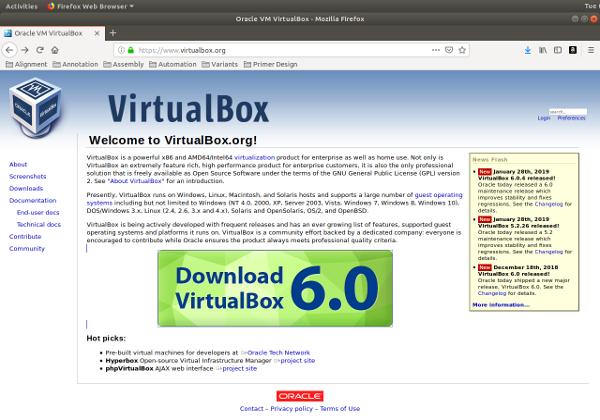
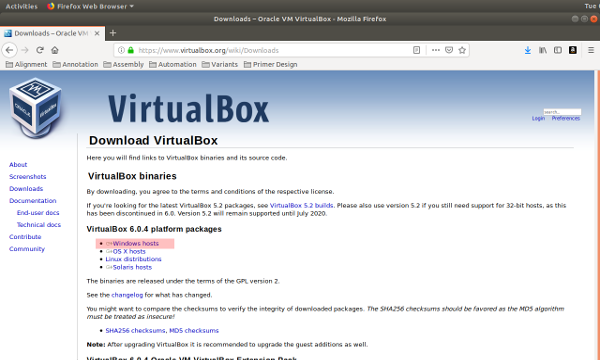
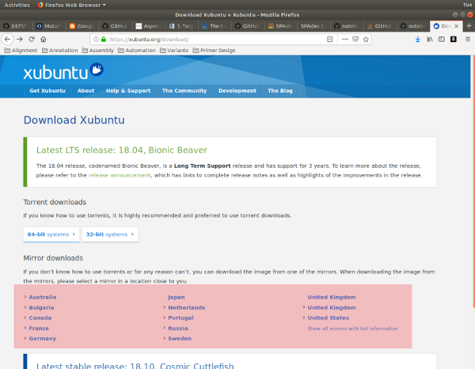
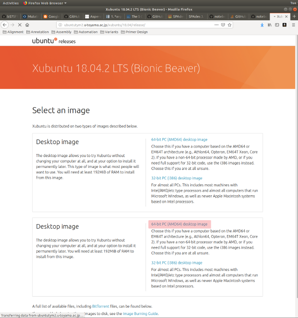

## Download Necessary Software

*Download VirtualBox*

1. Go to: [https://www.virtualbox.org](https://www.virtualbox.org)

2. Click on `Download VirtualBox 6.0` (at the time of this post, current version is 6.0).

    

3. Click on `Windows hosts` link to download VirtualBox, and save the file.

    

*Download Xubuntu ISO*

1. Go to: [https://xubuntu.org/download/](https://xubuntu.org/download/)

2. Under `Mirror downloads`, select the closest working site.

    

3. Click on `64-bit PC (AMD64) desktop image` link to download `Xubutu`, and save the file.

    

You are now ready to install VirtualBox, and then Ubuntu 18.04 LTS on your system. In a production environment, we typically prefer LTS (Long Term Stable) versions because they are supported by the developers for a longer time than experimental versions. Ubuntu LTS versions are typically supported for up to 10 years after their release.

[ [Index](./README.md) ] [ [Back](./00_linux_introduction.md) ] [ [Next](./02_install_virtualbox.md) ]