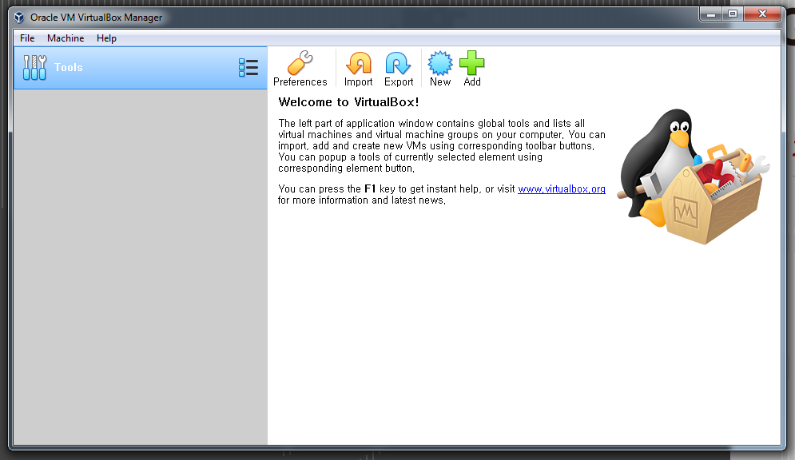
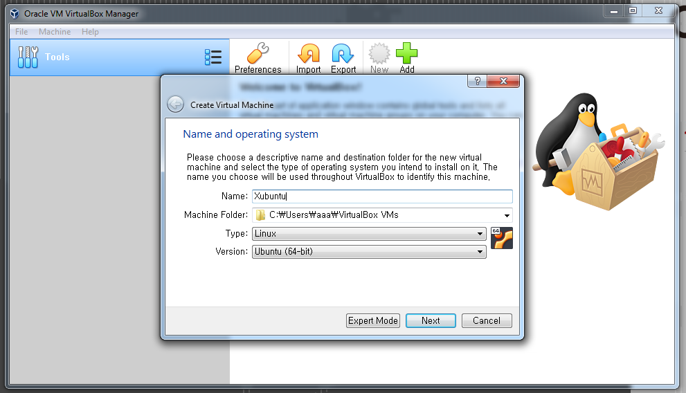
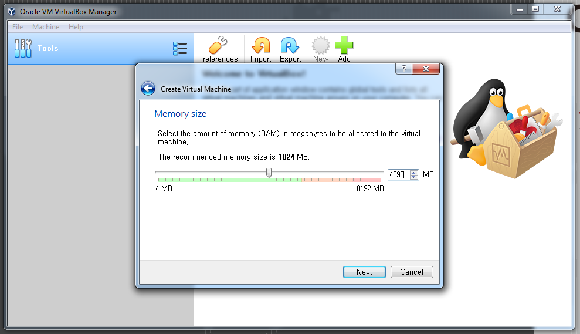
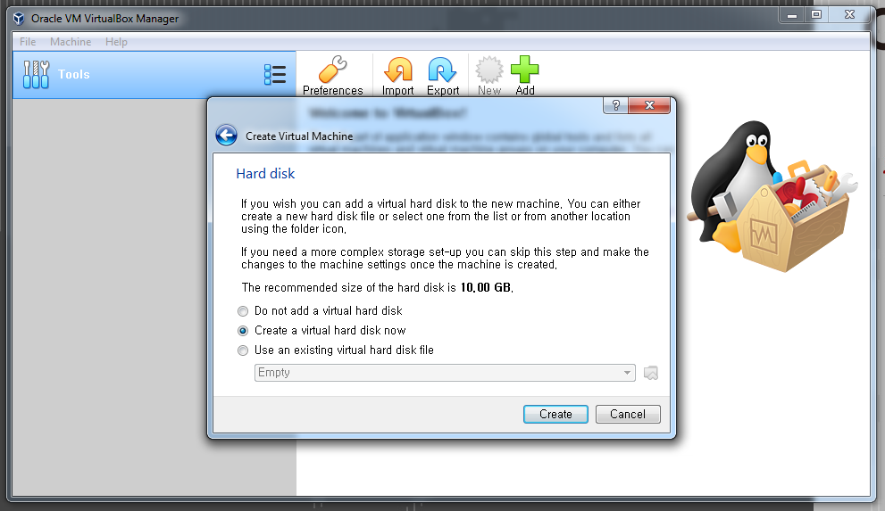
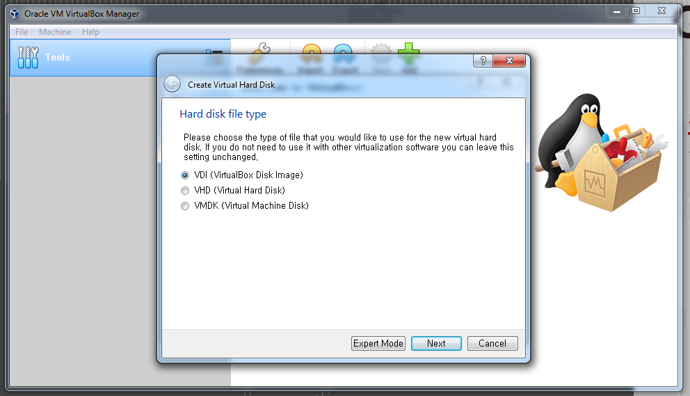
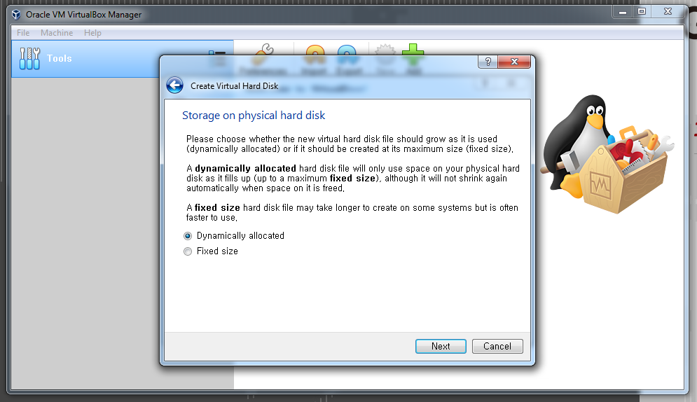
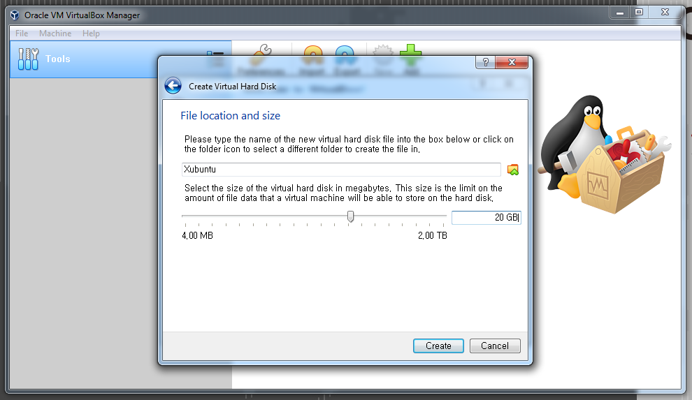
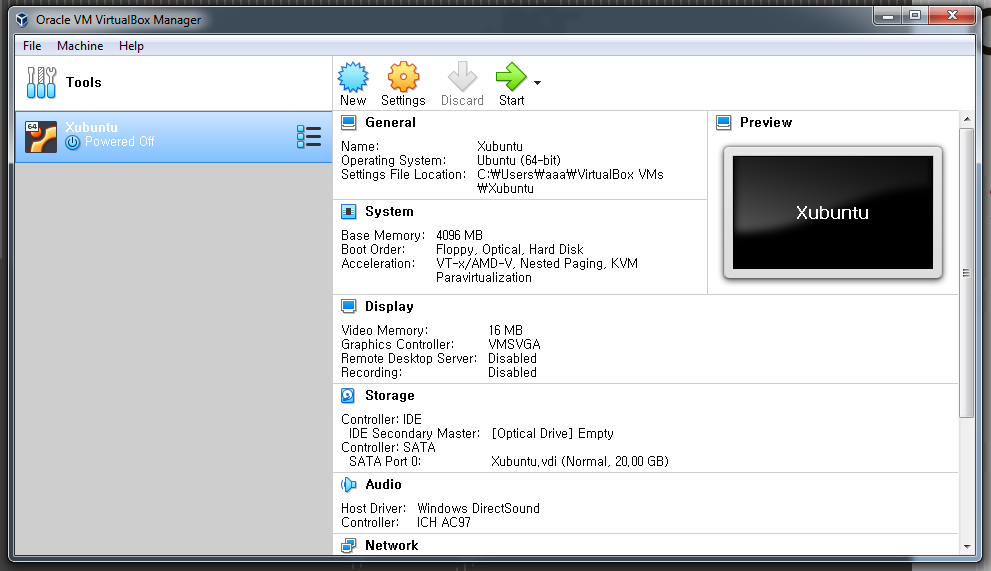

# Install VirtualBox

We will now install VirtualBox to manage our virtual machine environments.

1. Go to your `Downloads` folder, or the folder where VirtualBox was downloaded.

2. Double-click on the `Virtual-6.0.4-128413-Win.exe`* file to install VirtualBox on your system.

*Note*: file name could be different dependent on the date, or the mirror site the software was downloaded from.

3. Accept all of the default options, and confirm the installation.

4. After installation is finished, find the `shortcut` on your Windows Desktop, and double-click to start VirtualBox.

5. Since this is the first time to run VirtualBox, please click the `New` button to create a new virtual machine.

    

6. Enter a name for the virtual machine environment, here we have entered `Xubuntu`. Make sure the other options are selected as in the following figure. Click `Next` to proceed to the next step.

    

7. Set the `memory size` given to the virtual machine, this should be at least 4.0 GB. Click `Next` to continue.

    

8. Create a virtual hard disk for the virtual machine, the size will be set on the next page. Click the `Create` button to proceed.

    

9. We will use a `VirtualBox Disk Image` for the virtual machine. Click the `Next` button to continue.

    

10. Since this is the first virtual machine, we will create a `dyanmically allocated` virtual hard disk. Click the `Next` button to proceed.

    

11. Now, we will set the size of the virtual hard disk drive. Set this to at least 20.0 GB, if you need more space later you can either make a new virtual machine (this is recommended for different projects), or you may be able to `re-partition` the hard drive later. Click the `Create` button to finish the creation of the virtual machine.

    

After a few minutes, the VirtualBox Manager should look like the following figure.

    

[ [Index](./README.md) ] [ [Back](./01_download_software.md) ] [ [Next](./03_install_xubuntu.md) ]