# Install Xubuntu

Now that we have a virtual machine, we need to install an operating system for the virtual machine. We will use [Xubuntu](https://xubuntu.org) because [Ubuntu](https://www.ubuntu.com/) is a very popular distribution of Linux, and most bioinformatics programs and scripts should be able to run on a Ubuntu system.

1. Make sure that the `Xubuntu` virtual machine from the previous step is selected, then click the `Start` button to start the machine.

    

1. Make sure that the `Xubuntu` virtual machine from the previous step is selected, then click the `Start` button to start the machine.

    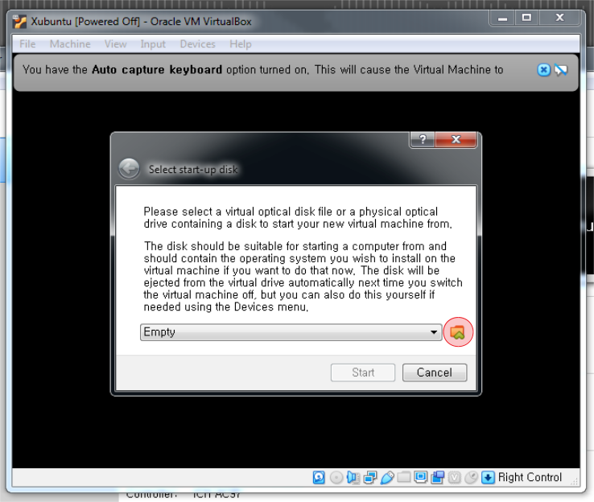

1. Make sure that the `Xubuntu` virtual machine from the previous step is selected, then click the `Start` button to start the machine.

    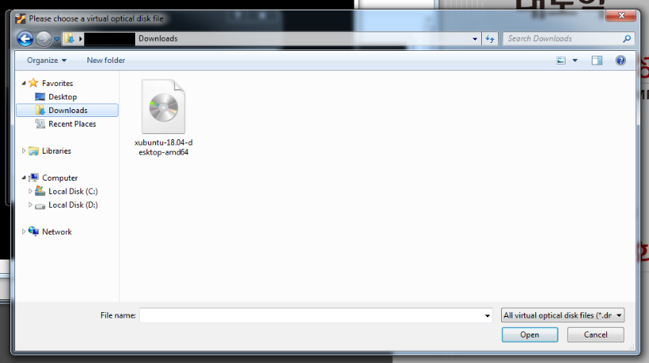

1. Make sure that the `Xubuntu` virtual machine from the previous step is selected, then click the `Start` button to start the machine.

    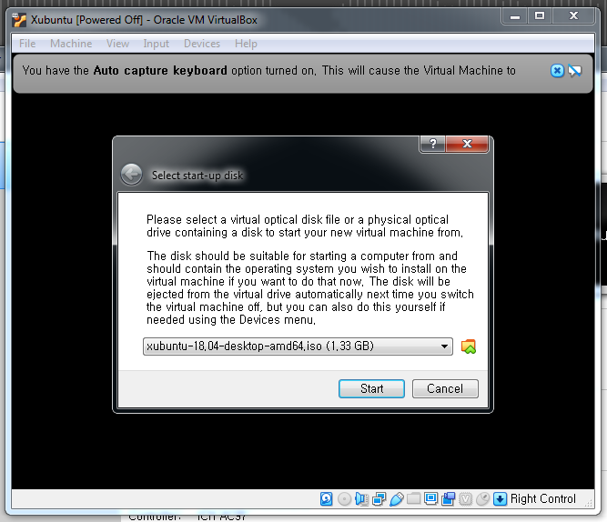

1. Make sure that the `Xubuntu` virtual machine from the previous step is selected, then click the `Start` button to start the machine.

    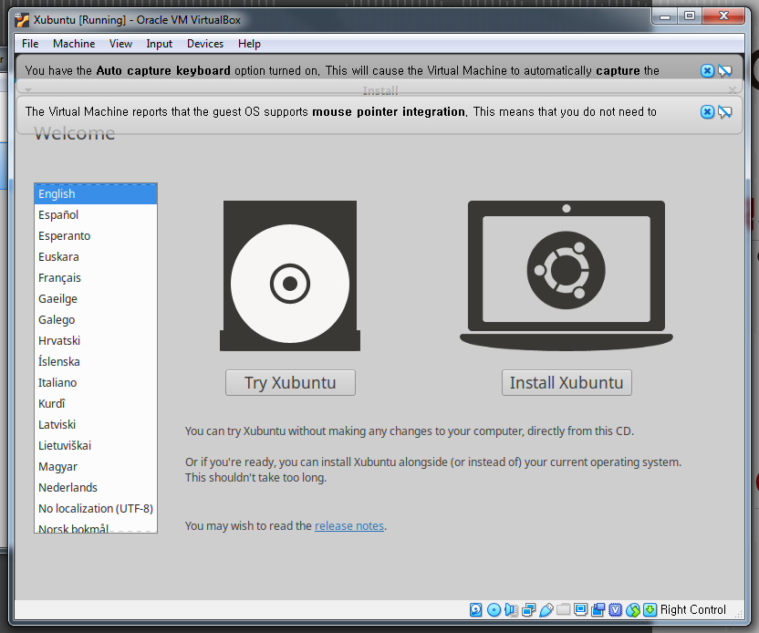

1. Make sure that the `Xubuntu` virtual machine from the previous step is selected, then click the `Start` button to start the machine.

    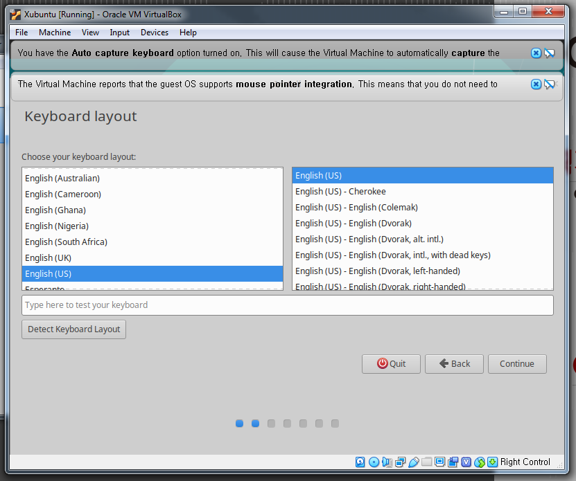

1. Make sure that the `Xubuntu` virtual machine from the previous step is selected, then click the `Start` button to start the machine.

    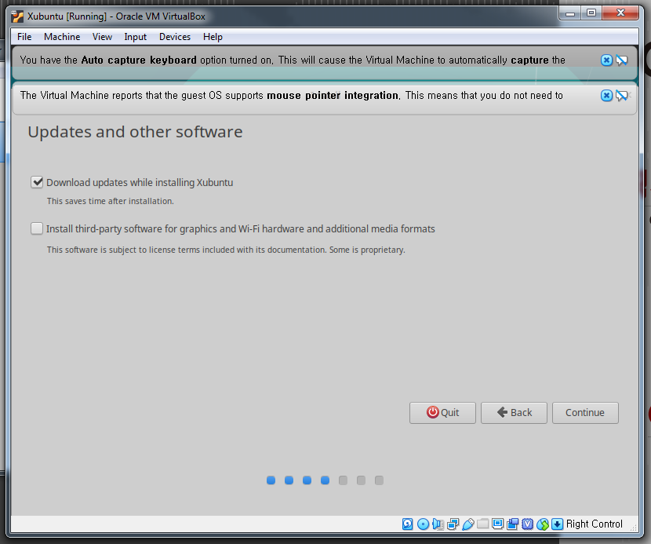

1. Make sure that the `Xubuntu` virtual machine from the previous step is selected, then click the `Start` button to start the machine.

    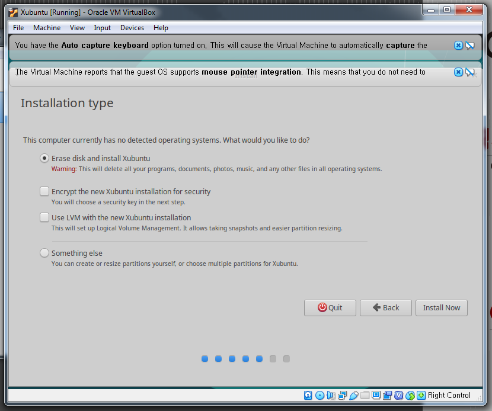

1. Make sure that the `Xubuntu` virtual machine from the previous step is selected, then click the `Start` button to start the machine.

    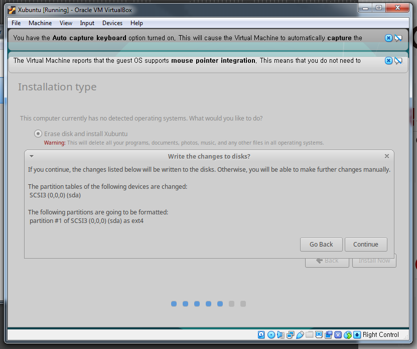

1. Make sure that the `Xubuntu` virtual machine from the previous step is selected, then click the `Start` button to start the machine.

    

1. Make sure that the `Xubuntu` virtual machine from the previous step is selected, then click the `Start` button to start the machine.

    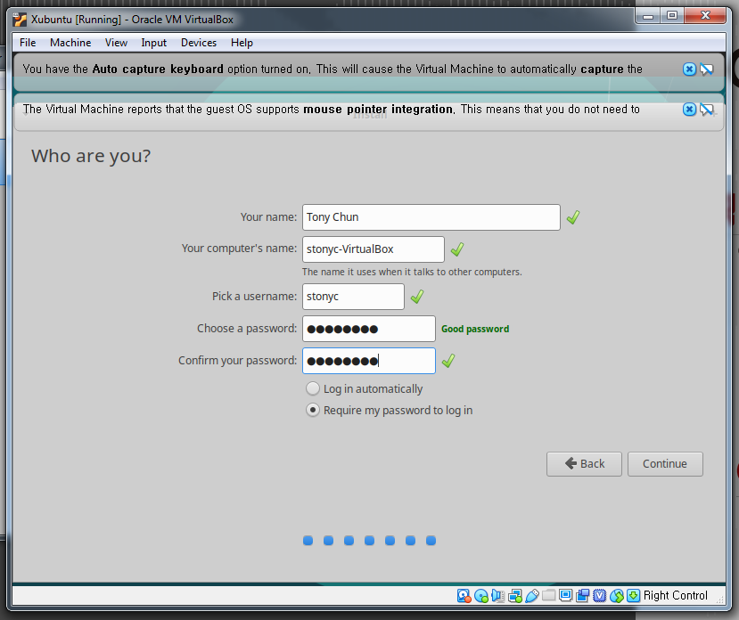

1. Make sure that the `Xubuntu` virtual machine from the previous step is selected, then click the `Start` button to start the machine.

    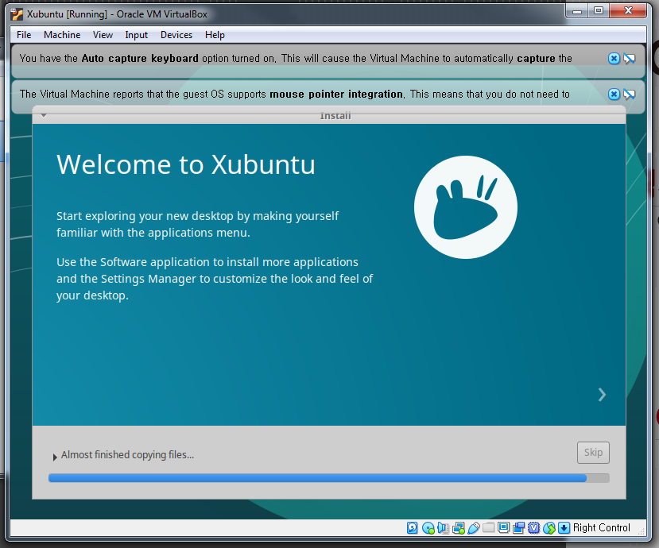

1. Make sure that the `Xubuntu` virtual machine from the previous step is selected, then click the `Start` button to start the machine.

    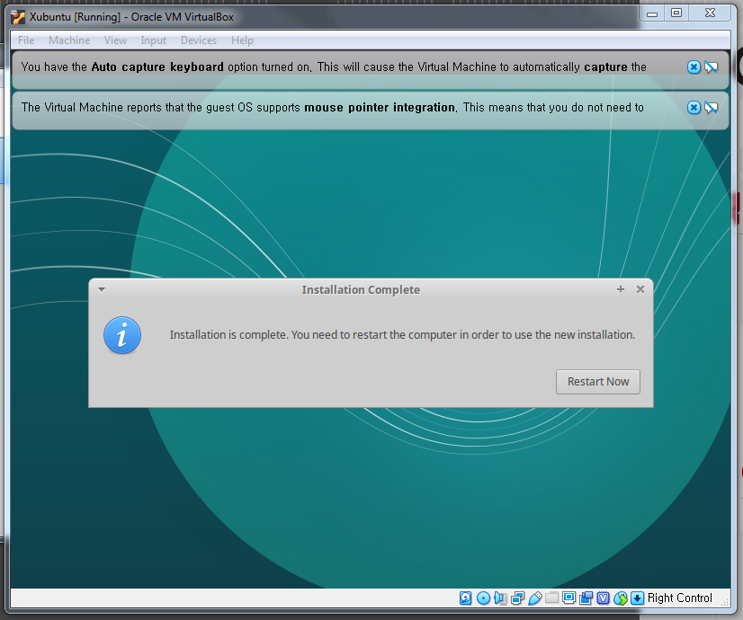

1. Make sure that the `Xubuntu` virtual machine from the previous step is selected, then click the `Start` button to start the machine.

    

1. Make sure that the `Xubuntu` virtual machine from the previous step is selected, then click the `Start` button to start the machine.

    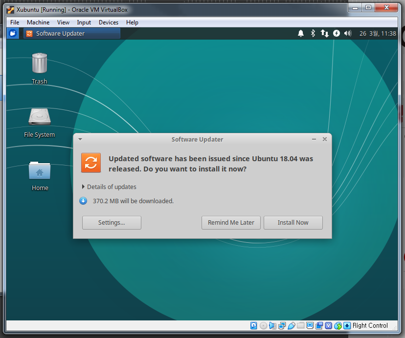

Now, `Xubuntu` should be successfully installed on your VirtualBox machine. Next, we will install Python, R and other common programming and statistical packages using the best available management and distribution system for data scientists and analysts: `[Anaconda](https://anaconda.org)`.

[ [Index](./README.md) ] [ [Back](./02_install_virtualbox.md) ] [ [Next](./04_install_anaconda.md) ]