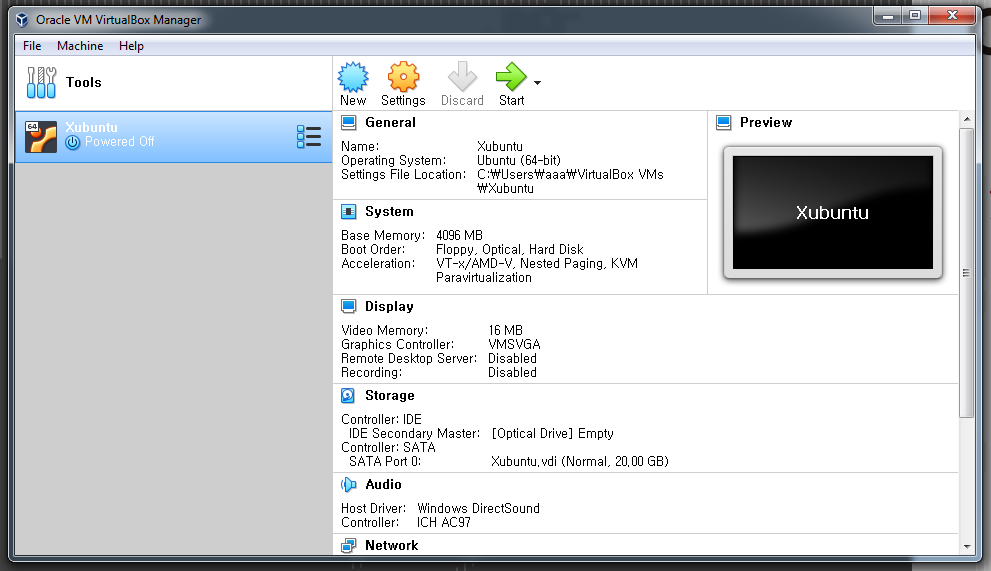
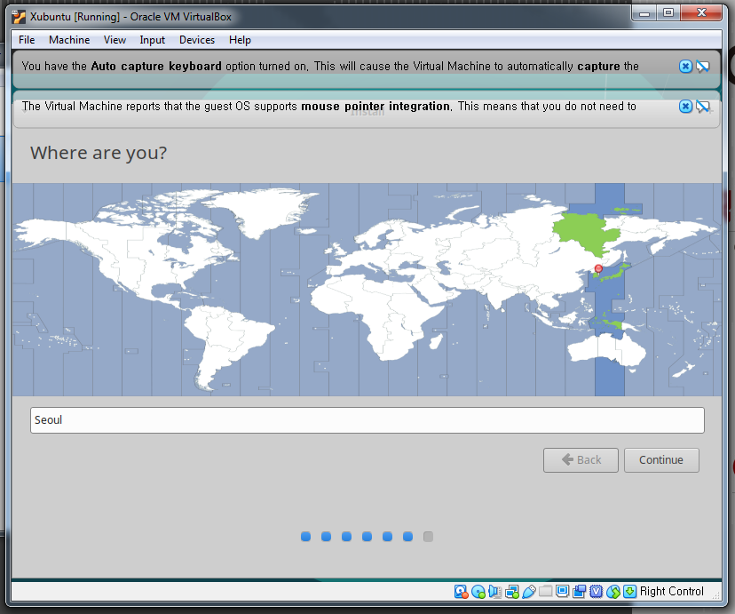

# Install Xubuntu

Now that we have a virtual machine, we need to install an operating system for the virtual machine. We will use [Xubuntu](https://xubuntu.org) because [Ubuntu](https://www.ubuntu.com/) is a very popular distribution of Linux, and most bioinformatics programs and scripts should be able to run on a Ubuntu system.

1. Make sure that the `Xubuntu` virtual machine from the previous step is selected, then click the `Start` button to start the machine.

    

2. Click on the `folder` icon to choose the `Xubuntu ISO` downloaded previously.

    

3. Navigate to the folder where the `Xubuntu ISO` was downloaded, select the file, and click the `Open` button to continue.

    

4. Make sure that the `xubuntu-18.04-desktop-amd64.iso` file is selected in the menu.

    

5. When given the options to `Try Xubuntu` or `Instal Xubuntu`, select `Install Xubuntu`.

    

6. Keyboard layout selected should be `English (US)`, then click the `Continue` button to go to the next step.

    

7. Select the `Download updates while installing Xubuntu` option to download necessary updates to the operating system, then click `Continue`.

    

8. Select the `Erase disk and install Xubuntu` option, then click the `Install Now` button to proceed.

    

9. Confirm the installation procedue by selecting the `Continue` button.

    

10. Select `Seoul` on the map to set the time of the operating system, then click `Continue`.

    

11. Finally, enter your `name`, `username`, and selected a `password` for your Xubuntu account. Click the `Continue` button to start the installation procedure.

    

12. Xubuntu will now be installed on the virtual machine environment, this step can take several minutes or longer depending on the speed of your computer.

    

13. After the install procedure is finished, click the `Restart Now` button to restart the Xubuntu system.

    

14. After Xubuntu has finished re-starting (you might have to enter the password you created in step `11`), enter your account password to log-in to Xubuntu.

    

15. Xubuntu should ask if you would like to update the operating system and other necessary software. Click the `Install Now` button, and then re-start Xubuntu after the updated software has been installed if necessary.

    

Now, `Xubuntu` should be successfully installed on your VirtualBox machine. Next, we will install Python, R and other common programming and statistical packages using the best available management and distribution system for data scientists and analysts: [Anaconda](https://anaconda.org).

[ [Index](./README.md) ] [ [Back](./02_install_virtualbox.md) ] [ [Next](./04_install_anaconda.md) ]