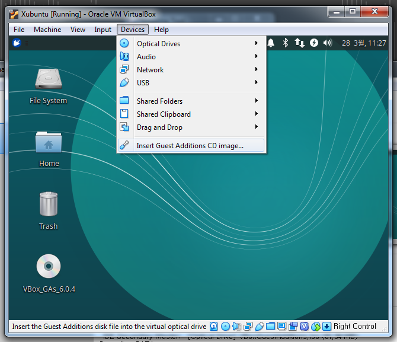
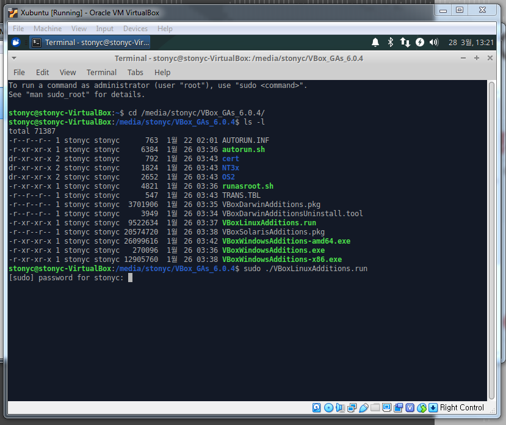
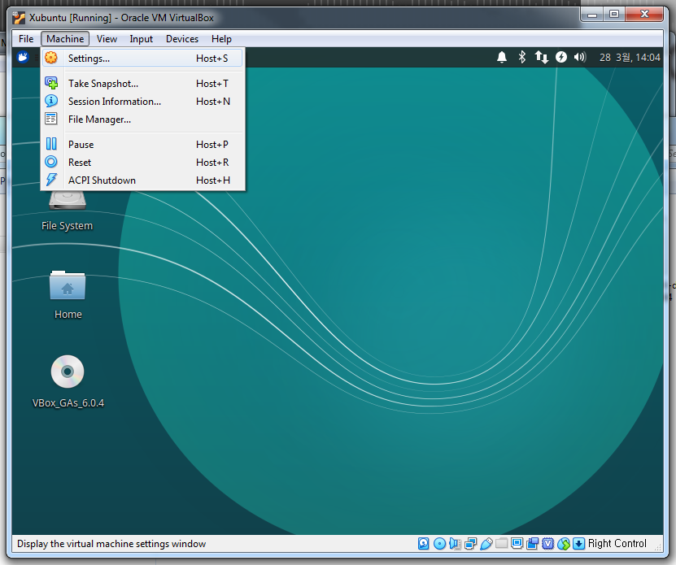
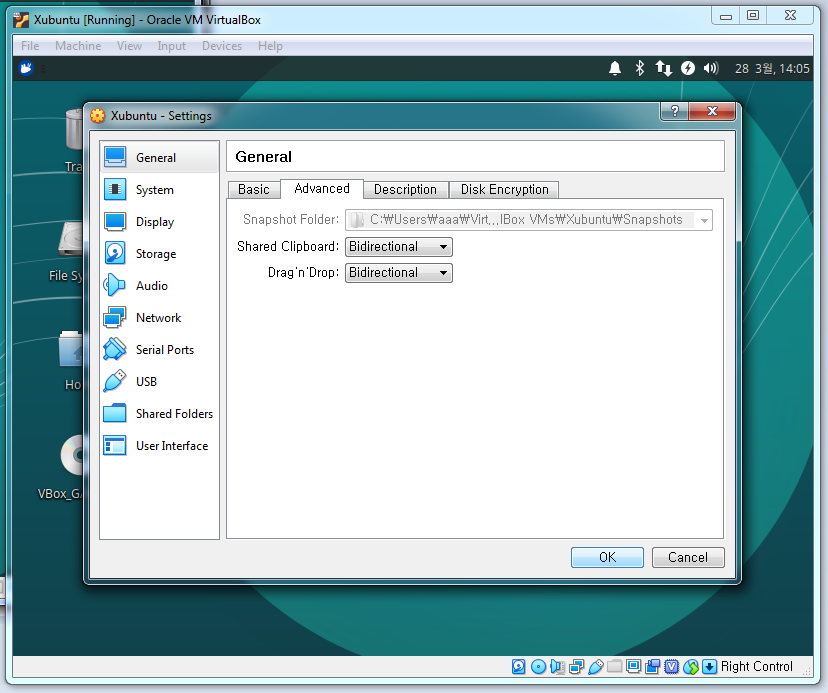

# Setup Xubuntu

Before we proceed to installing Python and other necessary software, we will set up the VirtualBox environment to easily share files with the host operating system, Windows.

1. Before installing the Virtual Guest Additions, open a `Terminal` or `Terminal Emulator` window (in Xubuntu) and type the following commands to make sure all of the existing software is up-to-date. Enter your password if asked to do so:

```bash
sudo apt update
sudo apt upgrade
```

2. Re-start your virtual environment to enable the upgrades, then re-open a `Terminal` window and enter the following command to install additional required packages:

```bash
sudo apt install build-essential dkms linux-header-$(uname -r)
```

3. Re-start your virtual environment once more, and then mount the VirtualBox Guest Additions CD image in your Xubuntu environment, by clicking on `Devices` and then clicking on `Insert Guest Additions CD image...` as in the following image.

    

4. Once the Guest Additions CD is mounted, open a `Terminal` or `Terminal Emulator` window, and move to the directory. An example of where the CD is mounted is show below. Once in the directory, enter the following command and enter your password if required:

    

```bash
cd /media/<your-username>/VBox_GAs_6.0.4/
sudo ./VBoxLinuxAdditions.run
```

5. Once the install procedure has finished, re-start your virtual environment one more time. Once Xubuntu has re-started, click on the `Machine` menu, and then click `Settings`:

    

6. Under the `General` menu, click the `Advanced` tab. Set both of the `Shared Clipboard` and `Drag'n'Drop` options to `Bidrectional`. Click the `Ok` button to finish.

    

Now, you should be able to drag-and-drop files between your Xubuntu environment and your Windows file system. In additon, copy-paste should work between the two file systems as well.

Next, we will install Python, R and other common programming and statistical packages using the best available management and distribution system for data scientists and analysts: [Anaconda](https://anaconda.org).


[ [Index](./README.md) ] [ [Back](./03_install_xubuntu.md) ] [ [Next](./05_install_anaconda.md) ]