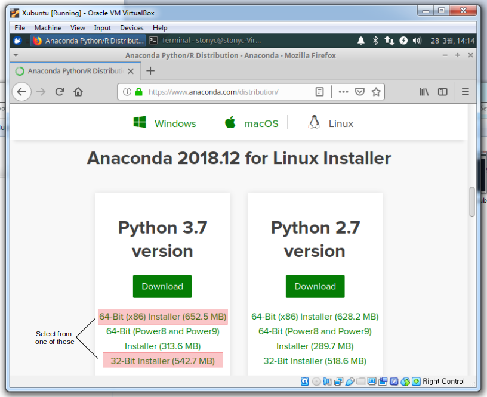

# Anaconda

[Anaconda](https://anaconda.com) is a package repository and management system designed to make widely used bioinformatics and data science software easy to download, manage, and upgrade. The default distribution of Anaconda includes packages and languages used by data analysts and scientists including Python, and software related to statistics, data management and even machine learning. Anaconda will be the basis for all of the programming and analytics shared in this series of tutorials.

1. Download [Anaconda](https://www.anaconda.com/distribution), make sure that Linux is selected as the operating system and then download the correct version of the installer based on your Xubuntu environment (64-bit or 32-bit). We will also download the Python 3.7 version. If you have software that requires Python 2.7, do not worry at this time because in Anaconda, different versions of Python can be installed using `conda environments`.

    

2. Once Anaconda has finished downloading, open a `Terminal` window and go to the directory it was downloaded to, and then enter the following commands:

    

```bash
cd Downloads/ # Depends on your system.
sudo sh Anaconda3-2018.12-Linux-x86_64.sh # This is on my workstation, your file may be different.
```

3. Follow the directions as you are prompted by the installer:

    * press `Enter` to continue 
    * then enter `yes`, press `Enter` to accept the default installation directory
    * then enter `yes` to allow Anaconda to modify your `.bashrc` file
    * finally enter `yes` or `no` to install MS VScode.

4. Exit the `Terminal` window by closing it, or enter `exit`.

5. Re-open a `Terminal` window, and type the following commands:

```bash
cd
sudo chown -hR <your-username>:<your-username> anaconda3/
```

Replace `<your-username>` with your account name as in the following example:

```bash
sudo chown -hR stonyc:stonyc anaconda3/
```

This command ensures that the anaconda3 folder and all of its sub-files are under the ownership of your user account.

6. Update all of the install Anaconda packages:

```bash
conda upgrade --all
```

All of the default Anaconda3 packages should now be installed and updated to the most recent versions. However, before you start to install additional packages, we should learn about Anaconda [virtual environments](../README.md) for developing and running software.


[ [Index](./README.md) ] [ [Back](./04_setup_xubuntu.md) ] [ [Next](./06_conda_environments.md) ]