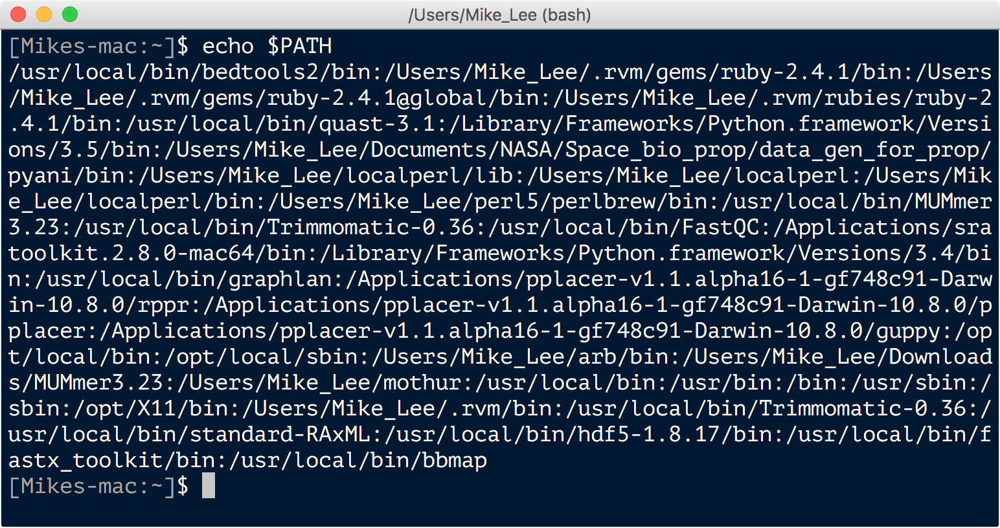
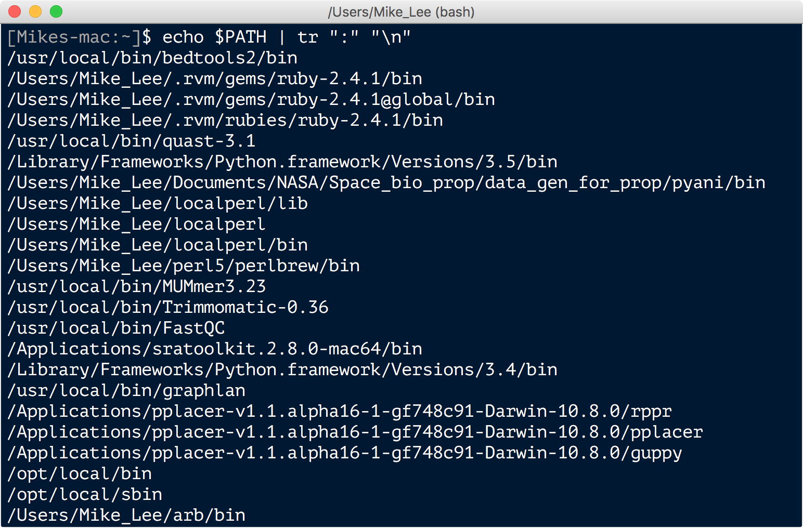
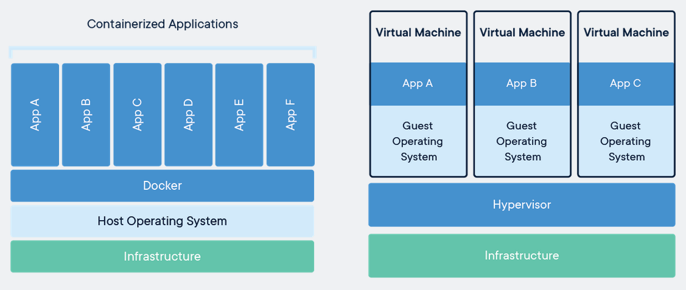
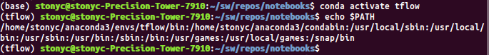

# **Conda Enviroments**

This is a multiple part series describing the use and deployment of `Virtual Environments`, `Virtual Machines`, and `Container` systems.

### **Why?**

In the age of Big Data, research is often shared with many people, repeated, and often scaled up depending on the size of the project. Therefore, the underlying algorithms, software and infrastructure must be **replicable** across many workstations, environments, servers, clusters, or even into the cloud. In order for research to be **replicable**, software developers often describe a set of instructions that define what is required by their algorithms/software to run correctly. These instructions often define other software that is required (**dependencies**), or even the operating system (Windows, Linux, OS X) that is needed to execute the analyses correctly and efficiently.

For example, when you install software into your Linux operating system, if you have **administrator** access to your workstation, you might download a package from the developer's website, then install the package according to their instructions. Often, you may need to tell your operating system where to find the newly installed package; this is usually done by adding the package's location to your `PATH` variable. Over time, after you have installed many software packages, your `PATH` variable might look like this:


*Image downloaded from:* [https://astrobiomike.github.io/bash/modifying_your_path](https://astrobiomike.github.io/bash/modifying_your_path)

This is a little hard to read, but the author provided another way to look at this `PATH` variable:


*Image modified from:* [https://astrobiomike.github.io/bash/modifying_your_path](https://astrobiomike.github.io/bash/modifying_your_path)

There are few things of interest to note in this example. First, he has two different versions of `Python` declared. Which version will be used by his Linux operating sytem? Second, what happens if he, for example, installs a new version of `MUMmer`? Would that require an updated version of `Python`? What if he installs a software package that requires `Python` version **2+** and not **3+**? 

There are some potential solutions to this problem, one of which would be to have different versions of his `.bashrc` or `.profile`, and then use the `source` command in Linux to load the environment and `PATH` variable that he requires for each project.

But what if there is an easier way?

### **How? (Part 1)**

There are multiple solutions to the problem described aboved, and the solution we will focus on in this section are `Virtual Environments`.

However, before going in to detail on `Virtual Environments`, let's take a step back and look broadly at the available solutions.

### **What?**

We have previously set up a `Virtual Machine` to run `Xubuntu` alongside `Windows`, so how are they related to `Virtual Environments` and `Container Systems`?

From the smallest 'footprint' to the largest, at the most basic level:

* a `Virtual Environment` encapsulates a set of **software** instructions or **dependencies**
* a `Docker Container` or `Container System` encapsulates the entire **software environment**
* a `Virtual Machine` encapsulates an the **software environment**, its **Operating System** and the underlying **Hardware**



We will learn more about `Docker` in the next section, but briefly `Docker Containers` have major advantages over traditional `Virtual Machines`:

* they share hardware with the underlying server or workstation
* they can be scaled to use multiple processers very easily
* they are smaller (few MBs versus 10s or 100s of MBs)

In practice, we can use a package environment manager like `conda` inside of a `Docker Container` system, and then use the `Container` across multiple servers, workstations, or users very easily.

### **How? (Part 2)**

Let's return to `Virtual Environments`. As described above, `Virtual Environments` encapsulate a set of **software** instructions or **dependencies**. When we wish to install a new software package, that software often **depends** on existing software to run. For example, let's look at the software required by the latest version of `TensorFlow` to run on a Linux workstation:

| Name | Version |
|-----:|:--------|
| absl-py | 0.7.1 |
| astor | 0.7.1 |
| bzip2 | 1.0.6 |
| c-ares | 1.15.0 |
| ca-certificates | 2019.3.9 |
| certifi | 2019.3.9 |
| gast | 0.2.2 |
| grpcio | 1.16.0 |
| h5py | 2.9.0 |
| hdf5 | 1.10.4 |
| keras-applications | 1.0.7 |
| keras-preprocessing | 1.0.9 |
| libblas | 3.8.0 |
| libcblas | 3.8.0 |
| libffi | 3.2.1 |
| libgcc-ng | 8.2.0 |
| libgfortran-ng | 7.3.0 |
| liblapack | 3.8.0 |
| libprotobuf | 3.7.1 |
| libstdcxx-ng | 8.2.0 |
| markdown | 2.6.11 |
| mock | 3.0.5 |
| ncurses | 6.1 |
| numpy | 1.16.3 |
| openblas | 0.3.6 |
| openssl | 1.0.2r |
| pip | 19.1 |
| protobuf | 3.7.1 |
| python | 3.7.1 |
| readline | 7.0 |
| scipy | 1.2.1 |
| setuptools | 41.0.1 |
| six | 1.12.0 |
| sqlite | 3.26.0 |
| tensorboard | 1.13.1 |
| tensorflow | 1.13.1 |
| tensorflow-estimator | 1.13.0 |
| termcolor | 1.1.0 |
| tk | 8.6.9 |
| werkzeug | 0.15.2 |
| wheel | 0.33.1 |
| xz | 5.2.4 |
| zlib | 1.2.11 |

Traditionally, in a simplified case, to install `TensorFlow` we might do the following:

* download the `0.7.1` version of the `absl-py` software package 
* check for other software packages that `absl-py` depends on
* download the required software packages that `absl-py` depends on
* install those other required software packages that `absl-py` depends on
* add those software packages to your `PATH` variable
* install `absl-py` to your Linux operating system
* add the `absl-py` software package to your `PATH` variable (if required)

Repeat those steps for every other software package listed above.

Then, repeat those steps if you want to install another software package to call genomic sequence variants using NGS data, like `GATK`:


| Name | Version |
|-----:|:--------|
| r_mutex | 1.0.0 |
| **bzip2** | **1.0.6** |
| **ca-certificates** | **2019.3.9** |
| cairo | 1.14.6 |
| **certifi** | **2019.3.9** |
| curl | 7.52.1 |
| fontconfig | 2.12.1 |
| freetype | 2.7 |
| gatk | 3.8 |
| gettext | 0.19.8.1 |
| glib | 2.51.4 |
| graphite2 | 1.3.13 |
| gsl | 2.4 |
| harfbuzz | 1.4.3 |
| icu | 58.2 |
| jpeg | 9c |
| **libblas** | **3.8.0** |
| **libcblas** | **3.8.0** |
| **libffi** | **3.2.1** |
| **libgcc** | **7.2.0** |
| **libgcc-ng** | **8.2.0** |
| **libgfortran-ng** | **7.3.0** |
| libiconv | 1.15 |
| libpng | 1.6.28 |
| **libstdcxx-ng** | **8.2.0** |
| libtiff | 4.0.7 |
| libxml2 | 2.9.5 |
| **ncurses** | *5.9* |
| **openblas** | **0.3.6** |
| openjdk | 8.0.192 |
| **openssl** | **1.0.2r** |
| pango | 1.40.4 |
| pcre | 8.41 |
| **pip** | **19.1** |
| pixman | 0.34.0 |
| **python** | *3.6.3* |
| r-assertthat | 0.2.0 |
| r-base | 3.3.2 |
| r-bitops | 1.0_6 |
| r-catools | 1.17.1 |
| r-colorspace | 1.3_2 |
| r-dichromat | 2.0_0 |
| r-digest | 0.6.12 |
| r-gdata | 2.18.0 |
| r-ggplot2 | 2.2.1 |
| r-gplots | 2.17.0 |
| r-gsalib | 2.1 |
| r-gtable | 0.2.0 |
| r-gtools | 3.5.0 |
| r-kernsmooth | 2.23_15 |
| r-labeling | 0.3 |
| r-lazyeval | 0.2.1 |
| r-magrittr | 1.5 |
| r-mass | 7.3_48 |
| r-munsell | 0.4.3 |
| r-plyr | 1.8.4 |
| r-rcolorbrewer | 1.1_2 |
| r-rcpp | 0.12.16 |
| r-reshape | 0.8.6 |
| r-reshape2 | 1.4.3 |
| r-scales | 0.4.1 |
| r-stringi | 1.1.7 |
| r-stringr | 1.2.0 |
| r-tibble | 1.2 |
| **readline** | *6.2* |
| **setuptools** | **41.0.1** |
| **sqlite** | *3.13.0* |
| **tk** | *8.5.19* |
| **wheel** | **0.33.1** |
| **xz** | **5.2.4** |
| **zlib** | *1.2.8* |

The software packages listed above in **bold** are required by both `TensorFlow` and `GATK`. The package versions listed in **bold** are the same in both `TensorFlow` and `GATK`, the package version listed in `italics` are different versions.

Now, what if you wanted to install `TensorFlow` and `GATK` on another workstation?


The above is one example why many people find it very hard to learn to use Linux.

### **How? (Part 3)**

So, what if you could install `TensorFlow` and `GATK`, any other package(s), or combination of packages with just a few commands? And, what if you **replicate** the exact same set of packages and package versions on another workstation or server just as easily?

How?

With `conda` environments.

With `conda`, you can create a separate environment for your analyses using `TensorFlow` and a separate environment for your analyses using `GATK` or any other major software package, and each environment is kept separate and clean from all of the other environments:

##### Create environment named `tflow` for TensorFlow:

```bash
# We give the `name` of the environment, and an optional `channel` to use as a source:
$ conda create -n tflow -c conda-forge tensorflow
```

##### Open the `tflow` environment:

```bash
$ conda activate tflow
```

< *several hours of TensorFlow analysis* >

##### Close the `tflow` environment:

```bash
$ conda deactivate
```

##### Create environment named `gatk` for GATK:

```bash
# We give the `name` of the environment, and an optional `channel` to use as a source:
$ conda create -n gatk -c bioconda gatk
```

##### Open the `gatk` environment:

```bash
$ conda activate gatk
```

< *several hours of GATK analysis* >

##### Close the `gatk` environment:

```bash
$ conda deactivate
```

##### List all of your `conda` environments:

```bash
$ conda info --envs
# conda environments:
#
base                  *  /home/stonyc/anaconda3
bmx                      /home/stonyc/anaconda3/envs/bmx
gapsolver                /home/stonyc/anaconda3/envs/gapsolver
gatk                     /home/stonyc/anaconda3/envs/gatk
spectre                  /home/stonyc/anaconda3/envs/spectre
tflow                    /home/stonyc/anaconda3/envs/tflow
```

That's it.

### **Implementation**

Now, let's see how we might implement this for a custom software package.

##### Download `GAP-SOLVER`:

```bash
$ git clone https://github.com/sangychun/gapsolver.git
```

##### Replicate the environment with `conda`:

```bash
$ cd /path/to/gapsolver/
$ conda env create -f environment.yml
```

##### Open the `GAP-SOLVER` environment:

```bash
$ conda activate gapsolver
```

##### Start the `GAP-SOLVER` analysis:

```bash
$ python /path/to/gapsolver.py --help
GAP-SOLVER: Genome Annotation Pipeline Solver

Usage: gapsolver.py [-h] -c=FILE -p=FILE -o=FILE -P=FILE [--polish=BOOL] [--threads=INT] [--name=STR] [--models=FILE] [--gff=FILE] [--proteins=FILE] [FASTQS ...]

-h --help             show this help message
-c,--current=FILE     path to current strain genome FASTA file (required)
-p,--previous=FILE    path to previous strain genome FASTA file (required)
-o,--orfs=FILE        path to previous strain ORFs nucleotide FASTA file (required)
-P,--prokka=FILE      path to previous strain Prokka annotation output table (required)
--polish=BOOL         polish/annotate current strain genome with Pilon and Prokka [default: False]
--models=FILE         path to previous strain database ORF models file (required if --polish=True)
--gff=file            path to current strain Prokka annotated GFF file (required if --polish=False)
--proteins=FILE       path to current strain ORFs amino acid FASTA file (required if --polish=False)
--name=STR            specify name of current strain genome (will be auto-detected if none provided)
--threads=INT         specify number of parallel threads to use for GAP-SOLVER analysis[default: 1]
FASTQS ...            space-delimited paths to paired end FASTQ files (required if --polish=True)
```

##### Close the `GAP-SOLVER` environment:

```bash
$ conda deactivate
```

### **Summary**

Here is what our `PATH` variable in the `TensorFlow` environment looks like:



That is a lot easier and cleaner than installing each software package (and their dependencies) one by one. And it is certainly cleaner than this, right?


*Image downloaded from:* [https://astrobiomike.github.io/bash/modifying_your_path](https://astrobiomike.github.io/bash/modifying_your_path)

Next, we will learn about `Docker` and `Container Systems`.

[ [Index](./README.md) ] [ [Back](./05_install_anaconda.md) ] [ [Next](./07_docker_containers.md) ]


