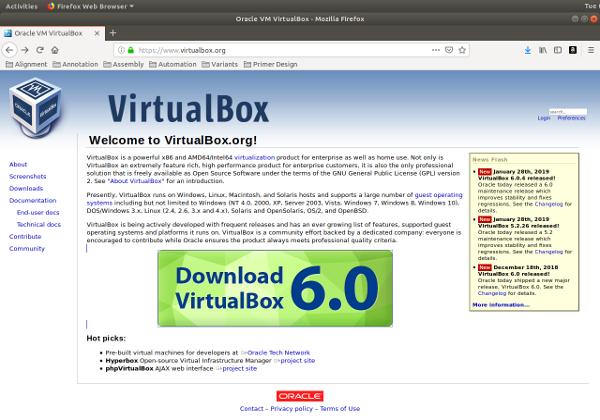
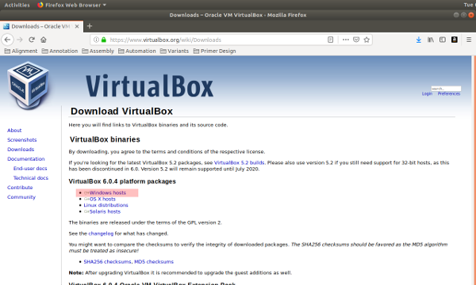
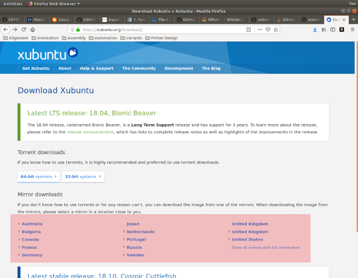
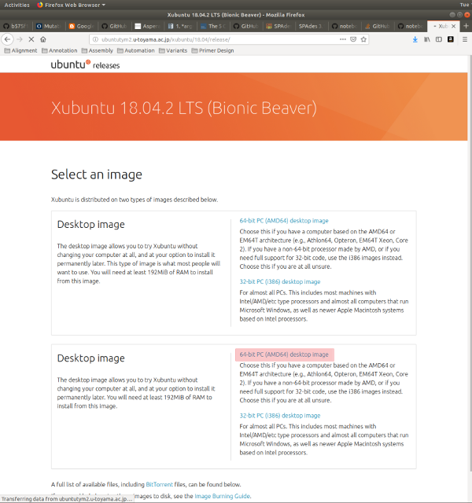

# **Virtual Machines**

### **Introduction**

The most simple definition of a [virtual machine](https://en.wikipedia.org/wiki/Virtual_machine) is that it is an isolated substitute for a real computer system with a fully functioning operating system. Virtual machines have many uses, including providing an alternate software environment within an existing operating system, such as running Unix natively within a Windows computing environment. The followng tutorial will walk through the set up of a [Xubuntu](https://xubuntu.org/) virtual machine in a Windows system using the free version of [VirtualBox](https://www.virtualbox.org/).

### **Step One**: Download Necessary Software

*Download VirtualBox*

1. Go to: [https://www.virtualbox.org](https://www.virtualbox.org)

2. Click on `Download VirtualBox 6.0` (at the time of this post, current version is 6.0)

3. Click on `Windows hosts` link to download VirtualBox, and save the file

*Download Xubuntu ISO*

1. Go to: [https://xubuntu.org/download/](https://xubuntu.org/download/)

2. Under `Mirror downloads`, select the closest working site

3. Click on `64-bit PC (AMD64) desktop image` link to download `Xubutu`, and save the file

You are now ready to install VirtualBox, and then Ubuntu 18.04 LTS on your system. Ubuntu LTS (Long Term Stable) versions are typically supported for 10 years after their release.

### **Step Two**: Install VirtualBox

*Install VirtualBox*

1. Go to your `Downloads` folder, or the folder where VirtualBox was downloaded

2. Double-click on the `Virtual-6.0.4-128413-Win.exe`* file to install VirtualBox on your system

*Note*: file name could be different dependent on the date, or the mirror site the software was downloaded from.

3. Accept all of the default options and confirm the installation procedure

### **Step Three**: Install Xubuntu

### **Step Four**: Update Xubuntu

### **Appendix**: Starting VirtualBox